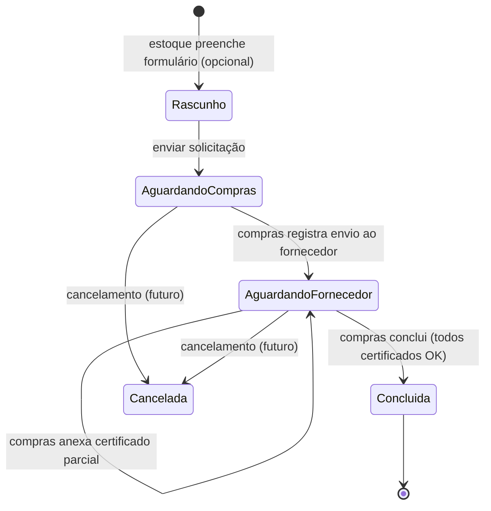

# Estados e ciclo de vida

## Diagrama de estados

---

## Estados

| Estado | Código sugerido | Descrição |
| ------ | --------------- | --------- |
| **Rascunho** | `RASCUNHO` | Formulário iniciado, ainda não enviado (opcional na v1) |
| **Aguardando compras** | `AGUARDANDO_COMPRAS` | Solicitação enviada; e-mail disparado; compras ainda não registrou contato com fornecedor |
| **Aguardando fornecedor** | `AGUARDANDO_FORNECEDOR` | Compras registrou envio ao fornecedor; aguardando certificados |
| **Concluída** | `CONCLUIDA` | Todos certificados anexados; estoque notificado |
| **Cancelada** | `CANCELADA` | Solicitação invalidada (regra futura) |

---

## Transições permitidas

| De | Para | Ator | Condição |
| -- | ---- | ---- | -------- |
| — | Aguardando compras | Estoque | Formulário válido + NF anexada |
| Aguardando compras | Aguardando fornecedor | Compras | Ação *Registrar envio ao fornecedor* |
| Aguardando fornecedor | Aguardando fornecedor | Compras | Anexo de certificado (parcial) |
| Aguardando fornecedor | Concluída | Compras | `certificados_anexados >= certificados_esperados` |
| Aguardando compras / Aguardando fornecedor | Cancelada | Estoque ou Compras | Regra a definir (Q-03, Q-04) |

---

## Histórico de eventos (auditoria)

Cada transição relevante gera registro no **histórico da solicitação**:

| Evento | Dados registrados |
| ------ | ----------------- |
| Solicitação criada | Usuário estoque, timestamp |
| E-mail enviado ao compras | Destinatário, timestamp |
| Envio ao fornecedor registrado | Usuário compras, timestamp |
| Certificado anexado | Nome arquivo, usuário compras, timestamp |
| Certificado removido | Nome arquivo, usuário, timestamp |
| Solicitação concluída | Usuário compras, timestamp |
| E-mail enviado ao estoque | Destinatário, timestamp |

---

## Regras por estado

### Aguardando compras

- Compras pode: visualizar NF, registrar envio ao fornecedor
- Compras **não** pode: anexar certificados (antes do registro de envio — RN-07)

### Aguardando fornecedor

- Compras pode: anexar/remover certificados, concluir (se quantidade OK)
- Estoque pode: visualizar status e histórico (somente leitura)

### Concluída

- Nenhuma alteração nos anexos (somente leitura)
- Estoque pode baixar NF e certificados

---

## Indicadores visuais sugeridos

| Estado | Cor / badge |
| ------ | ----------- |
| Aguardando compras | Amarelo |
| Aguardando fornecedor | Azul |
| Concluída | Verde |
| Cancelada | Cinza |
