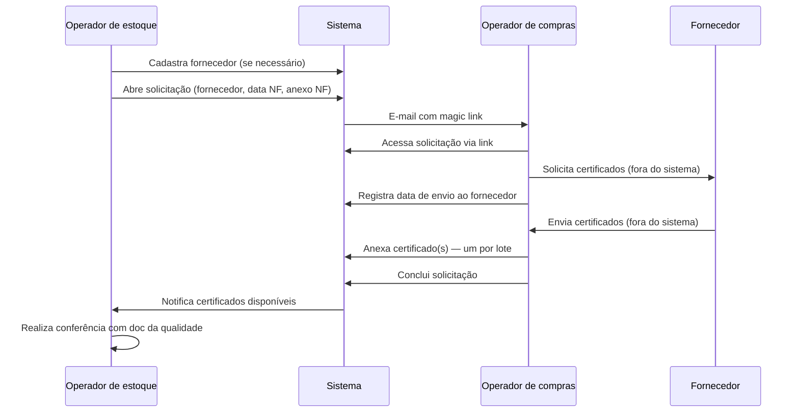

# Fluxo da solicitação

## Fluxo ponta a ponta

## Etapas detalhadas

### 1. Preparação — Cadastro de fornecedor

1. Operador de estoque acessa aba **Fornecedores**
2. Informa nome, CNPJ e descrição (opcional)
3. Fornecedor fica disponível no combobox da solicitação

### 2. Abertura — Solicitar certificado

1. Operador de estoque acessa aba **Solicitar certificado**
2. Seleciona **fornecedor** (combobox)
3. Informa **data da nota fiscal**
4. Informa **quantidade de certificados faltantes** (lotes sem certificado)
5. **Anexa a nota fiscal** (PDF ou formato definido)
6. Opcional: observações para o compras
7. Clica em **Enviar solicitação**
8. Sistema cria registro, muda status para *Aguardando compras* e dispara e-mail

### 3. Triagem — Compras recebe e-mail

1. Compras recebe e-mail com:
   - Fornecedor
   - Data da NF
   - Resumo da solicitação
   - **Magic link**
2. Compras clica no link e abre a tela da solicitação

### 4. Contato com fornecedor

1. Compras visualiza NF anexada e detalhes
2. Compras envia e-mail/cobra fornecedor **externamente**
3. No sistema, compras clica em **Registrar envio ao fornecedor**
4. Sistema grava data/hora e muda status para *Aguardando fornecedor*

### 5. Retorno dos certificados

1. Fornecedor envia certificados ao compras
2. Compras anexa cada certificado no sistema (identificando lote, se possível)
3. Quando todos os certificados esperados estão anexados, compras clica em **Concluir solicitação**
4. Status muda para *Concluída*
5. Estoque é notificado

### 6. Conferência pelo estoque

1. Operador de estoque acessa a solicitação concluída
2. Baixa certificados anexados
3. Confere cada certificado contra padrões internos (fora ou em sistema futuro)

---

## Fluxo simplificado (estados)

Ver detalhes em [Estados e ciclo de vida](./estados-e-ciclo-de-vida.md).

---

## Cenários alternativos (a detalhar na implementação)

| Cenário | Comportamento esperado |
| ------- | ---------------------- |
| Compras anexa certificados parciais | Solicitação permanece aberta até completar quantidade esperada |
| Estoque abre solicitação duplicada para mesma NF | Sistema deve alertar ou bloquear (regra a confirmar — Q-03/Q-04) |
| Magic link expirado | Compras solicita novo link ou acessa via listagem interna |
| Fornecedor envia certificados em etapas | Compras anexa incrementalmente até concluir |
