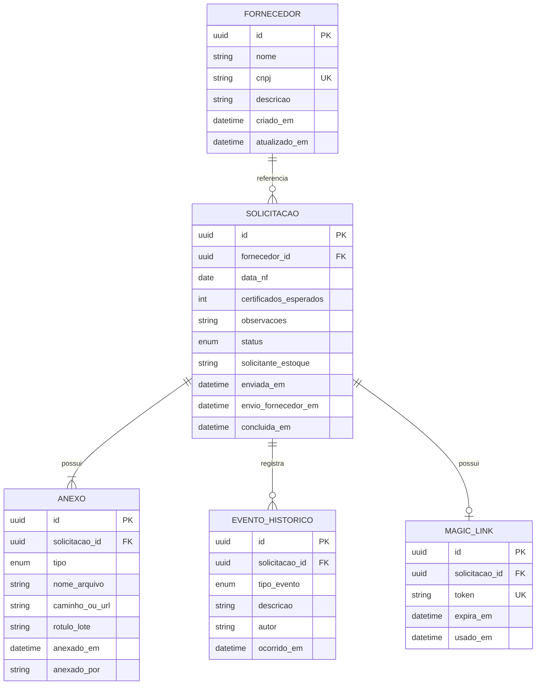

# Modelo conceitual

Modelo de dados em nível conceitual (sem implementação). Serve de base para API e banco na fase de desenvolvimento.

---

## Diagrama entidade-relacionamento

---

## Entidades

### Fornecedor

Representa o fornecedor de chapas.

| Atributo | Tipo | Notas |
| -------- | ---- | ----- |
| id | UUID | Identificador interno |
| nome | string | Razão social ou fantasia |
| cnpj | string | Único, formatado ou normalizado |
| descricao | string | Opcional |
| criado_em / atualizado_em | datetime | Auditoria |

---

### Solicitação

Registro central do fluxo de pedido de certificados para uma NF.

| Atributo | Tipo | Notas |
| -------- | ---- | ----- |
| id | UUID | Exibido como `#123` ou similar na UI |
| fornecedor_id | FK | Fornecedor da NF |
| data_nf | date | Data informada pelo estoque |
| certificados_esperados | int | Quantidade de lotes sem certificado |
| observacoes | text | Opcional |
| status | enum | Ver [Estados](./estados-e-ciclo-de-vida.md) |
| solicitante_estoque | string | Nome/e-mail do operador (até haver auth) |
| enviada_em | datetime | Momento do envio ao compras |
| envio_fornecedor_em | datetime | Quando compras registrou contato |
| concluida_em | datetime | Conclusão |

---

### Anexo

Arquivos vinculados à solicitação.

| Atributo | Tipo | Notas |
| -------- | ---- | ----- |
| id | UUID | |
| solicitacao_id | FK | |
| tipo | enum | `NOTA_FISCAL` \| `CERTIFICADO` |
| nome_arquivo | string | Nome original |
| caminho_ou_url | string | Storage (disco, S3, etc.) |
| rotulo_lote | string | Opcional; identifica lote do certificado |
| anexado_em | datetime | |
| anexado_por | string | Estoque (NF) ou Compras (certificado) |

**Regras:**

- Exatamente **1 anexo** do tipo `NOTA_FISCAL` por solicitação (na abertura)
- **N anexos** do tipo `CERTIFICADO` (N = certificados_esperados na conclusão)

---

### Evento histórico

Trilha de auditoria da solicitação.

| tipo_evento (exemplos) | Descrição |
| ---------------------- | --------- |
| `SOLICITACAO_CRIADA` | Abertura pelo estoque |
| `EMAIL_COMPRAS_ENVIADO` | Notificação disparada |
| `ENVIO_FORNECEDOR_REGISTRADO` | Compras registrou contato |
| `CERTIFICADO_ANEXADO` | Novo certificado |
| `CERTIFICADO_REMOVIDO` | Remoção de anexo |
| `SOLICITACAO_CONCLUIDA` | Fechamento |
| `EMAIL_ESTOQUE_ENVIADO` | Notificação de conclusão |

---

### Magic link

Token de acesso à solicitação para o compras.

| Atributo | Tipo | Notas |
| -------- | ---- | ----- |
| id | UUID | |
| solicitacao_id | FK | |
| token | string | Hash ou UUID v4 opaco |
| expira_em | datetime | Opcional |
| usado_em | datetime | Primeiro acesso (opcional, analytics) |

---

## Relacionamentos resumidos

| Relação | Cardinalidade |
| ------- | ------------- |
| Fornecedor → Solicitação | 1:N |
| Solicitação → Anexo | 1:N |
| Solicitação → Evento histórico | 1:N |
| Solicitação → Magic link | 1:1 (por solicitação ativa) |

---

## Storage de arquivos

Decisão pendente na implementação:

| Opção | Prós |
| ----- | ---- |
| Disco local | Simples para MVP |
| Object storage (S3, MinIO) | Escalável, backup |

Metadados dos arquivos permanecem na entidade **Anexo**; binários ficam no storage escolhido.
